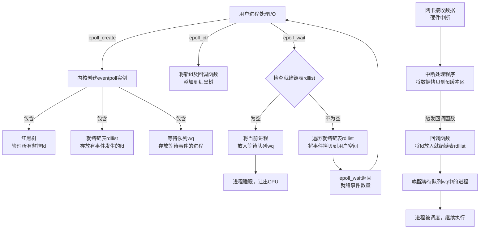

epoll 是为了克服 select 和 poll 在处理大量并发连接时性能低下的问题而设计的，特别适合高并发网络服务器应用。

epoll 最早出现在 Linux 内核 2.5.44 版本（2002年），是 Linux 特有的高性能 I/O 事件通知机制。

<!--more-->

<br/>

## 函数原型

[Linux manual page - epoll(7)](https://man7.org/linux/man-pages/man7/epoll.7.html)

```c
#include <sys/epoll.h>

// 创建 epoll 实例
int epoll_create(int size);
int epoll_create1(int flags);

// 控制（添加/修改/删除） epoll 事件
int epoll_ctl(int epfd, int op, int fd, struct epoll_event *_Nullable event);

// 等待事件
// Linux 2.6, glibc 2.3.2.
int epoll_wait(int epfd, struct epoll_event events[n], int n,
              int timeout);
// Linux 2.6.19, glibc 2.6.
int epoll_pwait(int epfd, struct epoll_event events[n], int n,
              int timeout,
              const sigset_t *_Nullable sigmask);
// Linux 5.11.
int epoll_pwait2(int epfd, struct epoll_event events[n], int n,
              const struct timespec *_Nullable timeout,
              const sigset_t *_Nullable sigmask);
```

### epoll_create

```c
int epoll_create(int size);
```

用于创建一个新的 epoll 实例。自 Linux 2.6.8 之后，`size` 参数被忽略，但是必须大于 0。

`epoll_create()` 返回一个代表新 epoll 实例的文件描述符。此文件描述符用于随后所有对于 epoll 接口的调用。当不需要的时候，应该使用 `close()` 关闭此文件描述符。当所有指向 epoll 实例的文件描述符关闭后，内核会销毁和释放所有相关的资源。

**返回值**

* 文件描述符（非负值）：创建成功。
* -1：创建失败，`errno` 用于指示失败原因。`errno =`：
  * `EINVAL`：`size` 不是正数。
  * `EINVAL`：`flags` 参数无效（`epoll_createl()`调用）。
  * `EMFILE`：已达到每个进程可打开文件描述符数量的上限。
  * `ENFILE`：已达到系统范围内打开文件总数的限制。
  * `ENOMEM`：内存不足，无法创建内核对象。

### epoll_create1

```c
int epoll_create1(int flags);
```

此函数为 `epoll_create` 的功能扩展。

如果 `flags` 是 0，`epoll_create1()` 等同于 `epoll_create()`。

`flags` 使用如下参数时，会获得不同的效果：

* `EPOLL_CLOEXEC`：在新文件描述符上设置close-on-exec（FD_CLOEXEC）标志。

**返回值**

同 `epoll_create()`。

### epoll_ctl

[Linux manual page - epoll_ctl(2)](https://man7.org/linux/man-pages/man2/epoll_ctl.2.html)

```c
int epoll_ctl(int epfd, int op, int fd,
                     struct epoll_event *_Nullable event);
```

此系统调用用于在文件描述符 epfd 所引用的 epol 实例的兴趣列表中添加、修改或移除条目。它请求对目标文件描述符 fd 执行操作 op。

合法的 op 参数：

* `EPOLL_CTL_ADD`：向epoll文件描述符epfd的兴趣列表中添加一个条目。该条目包含文件描述符fd、对应打开文件描述的引用（参见epoll(7)和open(2)）以及在event中指定的设置。
* `EPOLL_CTL_MOD`：将兴趣列表中与fd相关的设置更改为事件中指定的新设置。
* `EPOLL_CTL_DEL`：从关注列表中移除（注销）目标文件描述符fd。事件参数将被忽略，且可以为NULL（但请参阅下面的BUGS）。

#### epoll_event

`event` 参数描述了与文件描述符 `fd` 关联的对象。`epoll_event` 结构体：

```c
struct epoll_event {
    uint32_t     events;      /* 事件类型 */
    epoll_data_t data;        /* 用户数据 */
};

typedef union epoll_data {
    void        *ptr;
    int          fd;
    uint32_t     u32;
    uint64_t     u64;
} epoll_data_t;
```

**事件类型：**

- `EPOLLIN`：可读（`read()`）事件。
- `EPOLLOUT`：可写（`write()`）事件。
- `EPOLLRDHUP`：对端关闭连接或半关闭。（此标志对于使用边缘触发监控时编写简单代码以检测对等端关闭特别有用。）
- `EPOLLPRI`：异常情况。
- `EPOLLERR`：错误情况。当管道的读取端已关闭时，也会在管道的写入端报告此事件。对于此事件，`epoll_wait()` 总会报告；在调用 `epoll_ctl()` 时，无需在事件中设置它。
- `EPOLLHUP`：挂起事件。`epoll_wait()` 函数总是会等待此事件；在调用 `epoll_ctl()` 函数时，无需在事件中设置此事件。请注意，在从管道或流套接字等通道读取时，此事件仅表示对等端关闭了其通道端。只有在通道中的所有未处理数据都被消耗后，后续从通道读取才会返回0（文件结束）。
- `EPOLLET`：边沿触发模式（默认是水平触发）。
- `EPOLLONESHOT`：一次性通知。这意味着在epoll_wait 为文件描述符通知事件后，该文件描述符将在关注列表中被禁用，且epoll接口不会报告其他事件。用户必须使用EPOLL_CTL_MOD调用epoll_ctl()，以使用新的事件掩码重新启用该文件描述符。
- `EPOLLWAKEUP (since Linux 3.5)`：如果`EPOLLONESHOT`和`EPOLLET`已清除，且进程具有`CAP_BLOCK_SUSPEND`能力，请确保在此事件挂起或处理期间，系统不会进入“挂起”或“休眠”状态。从epoll_wait 调用返回该事件时起，直至在同一 epoll 文件描述符上再次调用epoll_wait 、关闭该文件描述符、使用`EPOLL_CTL_DEL` 移除事件文件描述符，或使用 `EPOLL_CTL_MOD` 清除事件文件描述符的 `EPOLLWAKEUP`，该事件均被视为“正在处理”。
- `EPOLLEXCLUSIVE (since Linux 4.5)`：为正在附加到目标文件描述符fd的epoll文件描述符设置独占唤醒模式。

**独占唤醒模式**

当发生唤醒事件且使用`EPOLLEXCLUSIVE`将多个epoll文件描述符附加到同一目标文件时，一个或多个epoll文件描述符将通过epoll_wait 接收事件。在此情况下（未设置`EPOLLEXCLUSIVE`时）的默认行为是所有epoll文件描述符都会接收事件。

如果同一个文件描述符存在于多个epoll实例中，其中一些带有`EPOLLEXCLUSIVE`标志，另一些则没有，那么事件将提供给所有未指定`EPOLLEXCLUSIVE`的epoll实例，以及至少一个指定了`EPOLLEXCLUSIVE`的epoll实例。

以下值可与`EPOLLEXCLUSIVE`一起指定：`EPOLLIN`、`EPOLLOUT`、`EPOLLWAKEUP`和`EPOLLET`。也可指定`EPOLLHUP`和`EPOLLERR`，但这不是必需的：通常，无论是否在events中指定，这些事件发生时都会被报告。尝试在events中指定其他值会返回`EINVAL`错误。

`EPOLLEXCLUSIVE` 仅可用于 `EPOLL_CTL_ADD` 操作；尝试将其与 `EPOLL_CTL_MOD` 一起使用会报错。如果已使用 epoll_ctl() 设置了 `EPOLLEXCLUSIVE`，则随后对同一 epfd、fd 对执行 `EPOLL_CTL_MOD` 操作会报错。如果 epoll_ctl() 调用在 events 中指定了 `EPOLLEXCLUSIVE`，并将目标文件描述符 fd 指定为 epoll 实例，则该调用同样会失败。

**返回值**

* 0：设置成功。
* -1：设置失败，`errno` 用于指示失败原因。`errno =`：
  * `EBADF`：`epfd` 或 `fd` 不是有效的文件描述符。
  * `EEXIST`：操作符为 `EPOLL_CTL_ADD`，且提供的文件描述符fd已在此epoll实例中注册。
  * `EINVAL`：epfd 不是 epoll 文件描述符，或者 fd 与 epfd 相同，或者此接口不支持所请求的操作 op。
  * `EINVAL`：在事件中与 EPOLLEXCLUSIVE 一起指定了一个无效的事件类型。
  * `EINVAL`：操作符为EPOLL_CTL_MOD，且事件包含EPOLLEXCLUSIVE。
  * `EINVAL`：操作符为 EPOLL_CTL_MOD，且 EPOLLEXCLUSIVE 标志之前已应用于此 epfd、fd 对。
  * `EINVAL`：事件中指定了 EPOLLEXCLUSIVE，且 fd 引用了一个 epoll 实例。
  * `ELOOP`：fd 指的是一个 epoll 实例，而此 EPOLL_CTL_ADD 操作将导致 epoll 实例之间形成相互监控的循环，或者 epoll 实例的嵌套深度超过 5。
  * `ENOENT`：当操作符为EPOLL_CTL_MOD或EPOLL_CTL_DEL时，文件描述符（fd）未在此事件轮询（epoll）实例中注册。
  * `ENOMEM`：内存不足，无法处理所请求的操作控制操作。
  * `ENOSPC`：在尝试向epoll实例注册（EPOLL_CTL_ADD）新的文件描述符时，遇到了由/proc/sys/fs/epoll/max_user_watches设置的限制。更多详细信息请参见epoll(7)手册页。
  * `EPERM`：目标文件 fd 不支持 epoll。如果 fd 引用的是普通文件或目录，则可能会发生此错误。

### epoll_wait

[Linux manual page - epoll_wait(2)](https://man7.org/linux/man-pages/man2/epoll_wait.2.html)

```c
int epoll_wait(int epfd, struct epoll_event events[n], int n,
                  int timeout);
    // Linux 2.6, glibc 2.3.2.
```

`epoll_wait()` 系统调用用于等待由文件描述符 epfd 所引用的 epoll 实例上的事件。`events` 所指向的缓冲区用于从就绪列表中返回关于关注列表中具有可用事件的文件描述符的信息。`epoll_wait()` 最多返回 `n` 个结果。`n` 参数必须大于零。

`timeout` 参数指定了 `epoll_wait()` 函数阻塞的毫秒数。时间以 `CLOCK_MONOTONIC` 时钟为准进行测量。

调用 `epoll_wait()` 函数会阻塞，直到发生以下情况之一：

- 文件描述符有事件到达；

- 调用被信号处理程序中断；

- 超时时间已到。

请注意，超时间隔将向上取整至系统时钟粒度，而内核调度延迟意味着阻塞间隔可能会略微超时。指定超时值为-1会导致epoll_wait()无限期阻塞，而指定超时值为零则会导致epoll_wait()立即返回，即使没有可用事件。

每个返回的epoll_event结构的数据字段包含的数据，与最近一次对epoll_ctl(2)（EPOLL_CTL_ADD、EPOLL_CTL_MOD）调用中为相应打开文件描述符指定的数据相同。

`events` 字段是一个位掩码，用于指示对应打开文件描述符已发生的事件。

### epoll_pwait

```c
int epoll_pwait(int epfd, struct epoll_event events[n], int n,
              int timeout,
              const sigset_t *_Nullable sigmask);
    // Linux 2.6.19, glibc 2.6.
```

`epoll_pwait()` 允许应用程序安全地等待，直到文件描述符就绪或捕获到信号。

`ready = epoll_pwait(epfd, &events, n, timeout, &sigmask);`，相当于原子性地执行如下操作：

```c
sigset_t origmask;

pthread_sigmask(SIG_SETMASK, &sigmask, &origmask);
ready = epoll_wait(epfd, &events, n, timeout);
pthread_sigmask(SIG_SETMASK, &origmask, NULL);
```

`sigmask` 参数可以指定为 `NULL`，在这种情况下，`epoll_pwait()` 等同于`epoll_wait()`。

### epoll_pwait2

```c
int epoll_pwait2(int epfd, struct epoll_event events[n], int n,
              const struct timespec *_Nullable timeout,
              const sigset_t *_Nullable sigmask);
    // Linux 5.11.
```

`epoll_pwait2()` 系统调用与 `epoll_pwait()` 相同，除了 `timeout` 参数。它接受一个 `timespec` 类型的参数，以便能够指定纳秒级别的超时时间。

<br/>

## 使用示例

以下是一个简单的示例，展示如何使用 `epoll()` 实现一个仅返回固定页面的 http 服务器。

```c
#include <stdio.h>
#include <stdlib.h>
#include <string.h>
#include <unistd.h>
#include <sys/socket.h>
#include <sys/epoll.h>
#include <netinet/in.h>
#include <arpa/inet.h>
#include <errno.h>
#include <fcntl.h>

#define PORT 8080
#define MAX_CLIENTS 1000
#define BUFFER_SIZE 4096
#define BACKLOG_N 1024
#define MAX_EVENTS (MAX_CLIENTS+1)

// 客户端连接状态结构体
typedef struct {
    char buffer[BUFFER_SIZE];   // 缓冲区
    int buffer_len;             // 缓冲区中数据长度
} client_t;

int set_nonblocking(int sockfd) {
    int flags = fcntl(sockfd, F_GETFL, 0);
    if (flags == -1) {
        perror("fcntl F_GETFL");
        return -1;
    }
    
    if (fcntl(sockfd, F_SETFL, flags | O_NONBLOCK) == -1) {
        perror("fcntl F_SETFL");
        return -1;
    }
    
    return 0;
}

int create_tcp_server(){
    int server_fd;
    struct sockaddr_in address;
    int opt = 1;
    
    // 创建socket
    if ((server_fd = socket(AF_INET, SOCK_STREAM | SOCK_NONBLOCK, 0)) == 0) {
        perror("socket failed");
        exit(EXIT_FAILURE);
    }
    
    // 设置socket选项，允许端口重用
    if (setsockopt(server_fd, SOL_SOCKET, SO_REUSEADDR, &opt, sizeof(opt))) {
        perror("setsockopt failed");
        exit(EXIT_FAILURE);
    }
    
    address.sin_family = AF_INET;
    address.sin_addr.s_addr = INADDR_ANY;
    address.sin_port = htons(PORT);
    
    // 绑定socket
    if (bind(server_fd, (struct sockaddr *)&address, sizeof(address)) < 0) {
        perror("bind failed");
        exit(EXIT_FAILURE);
    }
    
    // 开始监听
    if (listen(server_fd, BACKLOG_N) < 0) {
        perror("listen failed");
        exit(EXIT_FAILURE);
    }
    
    printf("HTTP服务器已启动，监听端口 %d...\n", PORT);
    return server_fd;
}

void send_http_response(int client_fd) {
    char *response = 
        "HTTP/1.1 200 OK\r\n"
        "Content-Type: text/html; charset=UTF-8\r\n"
        "Connection: close\r\n"
        "\r\n"
        "<!DOCTYPE html>\n"
        "<html>\n"
        "<head>\n"
        "    <title>Simple HTTP server(epoll)</title>\n"
        "</head>\n"
        "<body>\n"
        "    <h1>Hello from Epoll HTTP Server!!</h1>\n"
        "    <p>This is a simple HTTP server written in C language</p>\n"
        "    <p>Limit on client connections: %d</p>\n"
        "</body>\n"
        "</html>";
    
    char full_response[512];
    int len = snprintf(full_response, sizeof(full_response), response, MAX_CLIENTS);
    
    write(client_fd, full_response, len);
}

int main() {
    int server_fd = create_tcp_server();
    struct sockaddr_in client_addr;
    struct epoll_event ev, events[MAX_EVENTS];
    socklen_t client_addr_len = sizeof(client_addr);
    
    // 创建epoll实例
    int epoll_fd;
    if ((epoll_fd = epoll_create1(0)) < 0) {
        perror("epoll_create1 failed");
        exit(EXIT_FAILURE);
    }
    
    // 添加服务器socket到epoll
    ev.events = EPOLLIN | EPOLLET;  // 边缘触发模式
    ev.data.fd = server_fd;
    if (epoll_ctl(epoll_fd, EPOLL_CTL_ADD, server_fd, &ev) < 0) {
        perror("epoll_ctl: server_fd");
        exit(EXIT_FAILURE);
    }
    
    client_t clients;

    // 主循环
    while (1) {
        int nfds = epoll_wait(epoll_fd, events, MAX_EVENTS, -1);
        if (nfds < 0) {
            if (errno == EINTR) {
                //continue;  // 被信号中断，继续
                break;
            }
            perror("epoll_wait failed");
            break;
        }
        
        for (int i = 0; i < nfds; i++) {
            // 处理新连接
            if (events[i].data.fd == server_fd) {
                while (1) {
                    int client_fd = accept4(server_fd, (struct sockaddr *)&client_addr, 
                                           &client_addr_len, SOCK_NONBLOCK);
                    
                    if (client_fd < 0) {
                        if (errno == EAGAIN || errno == EWOULDBLOCK) {
                            // 没有更多待处理的连接
                            break;
                        }
                        perror("accept4 failed");
                        break;
                    }
                    
                    printf("新连接，socket fd: %d, IP: %s, 端口: %d\n", 
                           client_fd, inet_ntoa(client_addr.sin_addr), 
                           ntohs(client_addr.sin_port));
                    
                    // 设置非阻塞模式
                    if (set_nonblocking(client_fd) < 0) {
                        close(client_fd);
                        continue;
                    }
                    
                    // 添加客户端到epoll
                    ev.events = EPOLLIN | EPOLLET | EPOLLRDHUP;
                    ev.data.fd = client_fd;
                    
                    if (epoll_ctl(epoll_fd, EPOLL_CTL_ADD, client_fd, &ev) < 0) {
                        perror("epoll_ctl: client_fd");
                        close(client_fd);
                        continue;
                    }
                }
            } 
            // 处理客户端事件
            else {
                int client_fd = events[i].data.fd;
                
                // 检查连接是否关闭或出错
                if (events[i].events & (EPOLLRDHUP | EPOLLHUP | EPOLLERR)) {
                    printf("连接关闭或出错，socket fd: %d, errno: %#x\n", client_fd, events[i].events);
                    
                    epoll_ctl(epoll_fd, EPOLL_CTL_DEL, client_fd, NULL);
                    close(client_fd);
                    continue;
                }
                
                // 处理可读事件
                if (events[i].events & EPOLLIN) {
                    ssize_t bytes_read;
                    
                    // 边缘触发模式下，需要一次性读取所有数据
                    while (1) {
                        bytes_read = read(client_fd, 
                                         clients.buffer + clients.buffer_len,
                                         BUFFER_SIZE - clients.buffer_len - 1);
                        
                        if (bytes_read > 0) {
                            clients.buffer_len += bytes_read;
                            
                            // 检查是否收到完整的HTTP请求（简单判断是否有空行）
                            clients.buffer[clients.buffer_len] = '\0';
                            if (strstr(clients.buffer, "\r\n\r\n") != NULL) {
                                printf("收到完整HTTP请求 (socket %d):\n%s\n", 
                                       client_fd, clients.buffer);
                                
                                // 发送HTTP响应
                                send_http_response(client_fd);
                                
                                epoll_ctl(epoll_fd, EPOLL_CTL_DEL, client_fd, NULL);
                                close(client_fd);

                                memset( clients.buffer, '\0', clients.buffer_len );
                                clients.buffer_len = 0;
                                break;
                            }
                            
                            // 如果缓冲区满了，清空缓冲区
                            if (clients.buffer_len >= BUFFER_SIZE - 1) {
                                clients.buffer_len = 0;
                            }
                        } 
                        else if (bytes_read == 0) {
                            // 连接关闭
                            printf("客户端关闭连接，socket fd: %d\n", client_fd);
                            
                            epoll_ctl(epoll_fd, EPOLL_CTL_DEL, client_fd, NULL);
                            close(client_fd);
                            memset( clients.buffer, '\0', clients.buffer_len );
                            clients.buffer_len = 0;
                            break;
                        } 
                        else {
                            if (errno == EAGAIN || errno == EWOULDBLOCK) {
                                // 没有更多数据可读
                                close(client_fd);
                                break;
                            } else {
                                // 读取错误
                                perror("read failed");
                                
                                epoll_ctl(epoll_fd, EPOLL_CTL_DEL, client_fd, NULL);
                                close(client_fd);
                                memset( clients.buffer, '\0', clients.buffer_len );
                                clients.buffer_len = 0;
                                break;
                            }
                        }
                    }
                }
            }
        }
    }
    
    // 清理资源
    printf("Clear resources.\r\n");
    close(server_fd);
    close(epoll_fd);
    
    return 0;
}
```

其主要工作流程如下：


<br/>

## 实现原理

Linux epoll 的核心工作机制可以概括为：**通过在内核中维护一个事件表（由高效的红黑树管理），并采用事件驱动的回调机制，仅将就绪的文件描述符通过双向链表返回给用户程序，从而避免了传统的无差别轮询和海量数据拷贝，实现了高效、可扩展的 I/O 多路复用**。

### 内核数据结构

1. **epoll 实例**：

   ```c
   struct eventpoll {
       // 红黑树根节点，存储所有监控的文件描述符
       struct rb_root rbr;
       
       // 就绪队列，存放已就绪的事件
       struct list_head rdllist;
   
       // 等待队列，用于进程阻塞
       wait_queue_head_t wq;
       
       // ...
   };
   ```

   epoll 的高效始于其在内核中精心设计的核心数据结构 `eventpoll`。你可以把它想象成一个用于管理大量文件描述符的"超级管家"。这个管家手里主要有三个关键工具：

   - **兴趣列表 (rbr)**：一个**红黑树 (RB-Tree)** 结构。它记录了用户进程注册了监控兴趣的所有文件描述符。红黑树作为一种高效的平衡二叉树，使得对大量文件描述符的增、删、改操作的时间复杂度稳定在 O(log n)，这是 epoll 能够处理海量连接的基础。
   - **就绪列表 (rdllist)**：一个**双向链表 (Doubly Linked List)**。它用于存放那些发生了 I/O 事件、已经"准备好"被处理的文件描述符。内核只将有事件发生的文件描述符放入这个链表。
   - **等待队列 (wq)**：当用户进程调用 `epoll_wait` 且当前没有事件发生时，进程会被挂起，并被放入这个等待队列中，直到被事件唤醒。

2. **关键数据结构关系**：

   ```sh
   epoll 实例
   ├── 红黑树 (rbr)
   │   └── 存储所有 epitem（每个监控的文件描述符）
   │       ├── file descriptor
   │       ├── epoll_event
   │       └── 回调函数
   └── 就绪链表 (rdllist)
       └── 存储已就绪的 epitem
   ```


### 核心工作机制：三个系统调用的协作

epoll 的工作流程通过三个主要的系统调用紧密协作来完成。

#### 第一步：创建实例 - `epoll_create`

*   **你做什么**：在程序开始时，调用 `epoll_create` 告诉内核要创建一个 epoll 实例。
*   **内核做什么**：内核会分配一个上文中提到的 `eventpoll` 对象（包含红黑树、就绪链表等），并返回一个与该实例关联的文件描述符（`epfd`），供后续操作使用。

#### 第二步：注册事件 - `epoll_ctl`

*   **你做什么**：调用 `epoll_ctl`，将需要监控的文件描述符（例如一个 socket 连接）和感兴趣的事件（如 `EPOLLIN` 可读事件）添加到 epoll 实例中。
*   **内核做什么**：这是构建高效监控体系的关键一步。
    1. 内核在 epoll 实例的红黑树中查找，如果不存在，则创建一个 `epitem` 对象来封装这个文件描述符和事件，并将其作为节点插入到红黑树中。
    2. 同时，内核还为这个被监控的文件描述符**注册一个回调函数**（通常名为 `ep_poll_callback`）。这个回调函数至关重要，它会在该文件描述符上的 I/O 事件就绪时被自动调用。

#### 第三步：等待事件 - `epoll_wait`

*   **你做什么**：调用 `epoll_wait`，让进程等待事件的发生。
*   **内核做什么**：这是事件驱动的核心体现。
    1. **检查就绪链表**：首先，内核会检查 epoll 实例的**就绪链表是否为空**。
    2. **进程挂起**：如果就绪链表为空，内核会将当前进程从工作队列移到 epoll 实例的**等待队列**中，并将进程挂起，让出 CPU。
    3. **事件触发与唤醒**：当网卡接收到数据，通过 DMA 等方式将数据拷贝到内核缓冲区后，会触发硬件中断。中断处理程序会找到对应的 socket，并将数据放入其接收缓冲区。随后，之前注册的**回调函数被自动调用**。这个回调函数会做两件事：
       *   将发生事件的 socket 对应的 `epitem` 添加到 epoll 实例的**就绪链表**（rdllist）中。
       *   唤醒在 epoll 实例等待队列中挂起的进程，将其移回工作队列，等待 CPU 调度。
    4. **返回结果**：当进程被唤醒再次执行时，`epoll_wait` 就能直接遍历就绪链表，并将链表中的事件通过参数（`events` 数组）拷贝回用户空间，然后返回就绪事件的数量。整个过程的时间复杂度仅为 **O(1)**，因为它只处理活跃的连接，与总连接数无关。

为了帮助你更直观地理解，这里是一个简化的流程图：



<br/>

## 综合对比

### 快速对比表

| 特性维度              | select                   | poll                         | epoll                          |
| --------------------- | ------------------------ | ---------------------------- | ------------------------------ |
| **诞生时间**          | 1983年 (4.2BSD)          | 1986年 (System V R3)         | 2002年 (Linux 2.5.44)          |
| **跨平台性**          | 几乎所有UNIX/Linux       | 大部分UNIX，Windows不支持    | Linux特有                      |
| **文件描述符限制**    | FD_SETSIZE(通常1024)     | 无硬编码限制                 | 无硬编码限制                   |
| **时间复杂度**        | O(n)                     | O(n)                         | O(1)                           |
| **内核-用户空间拷贝** | 每次调用都拷贝整个fd_set | 每次调用都拷贝整个pollfd数组 | mmap共享内存，无拷贝           |
| **触发模式**          | 水平触发(LT)             | 水平触发(LT)                 | 支持水平触发(LT)和边沿触发(ET) |
| **实现原理**          | 轮询所有fd               | 轮询所有fd                   | 回调通知机制                   |
| **编程复杂度**        | 中等                     | 简单                         | 复杂                           |
| **内存使用**          | 低                       | 中等                         | 高                             |
| **适用场景**          | 少量连接，跨平台         | 中等连接数，简单应用         | 高并发，大量连接               |

### 内存使用对比

```
用户空间            内核空间
---------         ---------
select:   fd_set  →  [完整拷贝] → 内核fd_set
                    [完整拷贝] ←
                    
poll:     pollfd[] → [完整拷贝] → 内核pollfd[]
                    [完整拷贝] ←
                    
epoll:    events[] ← [共享内存] → 就绪队列
              ↓           ↓
            mmap         mmap
```

### 触发机制对比

| 特性         | 水平触发 (LT)                                                | 边沿触发 (ET)                                                |
| ------------ | ------------------------------------------------------------ | ------------------------------------------------------------ |
| 触发条件     | 只要文件描述符上有数据可读/可写                              | 状态变化时                                                   |
| 事件处理频率 | 高。如果数据没处理完，会一直被通知。                         | 低。每个 I/O 事件只会被通知一次。                            |
| 数据读取     | 可以处理一部分数据，下次循环再处理剩余部分。可以使用阻塞式 I/O，但非阻塞更佳。 | 必须一次读完。必须使用**非阻塞式文件描述符**，并且要**循环调用 `read`/`write` 直到返回 `EAGAIN` 错误**，以确保本次事件的所有数据都被处理完，否则可能遗漏数据并导致无限期阻塞。 |
| 性能         | 较低                                                         | 较高                                                         |
| 编程复杂度   | 简单，编程出错概率小，适用于大部分常规场景。                 | 复杂，高性能模式，减少了 `epoll_wait` 的调用次数，适合追求极致性能的应用。 |

### 场景选择指南

```
选择 I/O 多路复用机制
│
├── 需要跨平台支持？
│   ├── 是 → 使用 select
│   └── 否
│       ├── 连接数 < 1000？
│       │   ├── 是 → 使用 poll（简单）或 select
│       │   └── 否
│       │       ├── 运行在Linux？
│       │       │   ├── 是 → 使用 epoll
│       │       │   └── 否
│       │       │       ├── BSD/macOS → 使用 kqueue
│       │       │       └── Windows → 使用 IOCP
│       └── 需要高性能？
│           └── 是 → 使用 epoll（Linux）或 kqueue（BSD）
```

### 现代替代方案

跨平台抽象库：

```
// 使用 libevent（跨平台，自动选择最佳后端）
struct event_base *base = event_base_new();
struct event *ev = event_new(base, sockfd, EV_READ, callback, NULL);
event_add(ev, NULL);
event_base_dispatch(base);

// 使用 boost::asio（C++）
asio::io_context io_context;
asio::ip::tcp::socket socket(io_context);
socket.async_read_some(asio::buffer(data), handler);
io_context.run();
```

### 总结建议

| 选择标准          | 推荐方案           | 理由                             |
| ----------------- | ------------------ | -------------------------------- |
| **需要跨平台**    | select 或 libevent | select 最通用，libevent 封装更好 |
| **连接数 < 1000** | poll               | 简单易用，无fd数量限制           |
| **连接数 > 1000** | epoll (Linux)      | 性能最好，O(1)复杂度             |
| **高并发服务器**  | epoll + 非阻塞IO   | 最高性能，需处理ET模式           |
| **简单客户端**    | select 或 poll     | 代码简单，易于维护               |
| **C++项目**       | boost::asio        | 面向对象，功能强大               |

**最终建议：**

1. 对于新项目，优先考虑使用高级抽象库（libevent、boost::asio）
2. 如果必须使用原生API： Linux服务器：epoll 跨平台简单应用：poll 嵌入式/资源受限：select
3. 理解底层原理，但根据实际需求选择最合适的工具

<br/>

## 参考

* 《Linux/UNIX 系统编程手册》第63章
