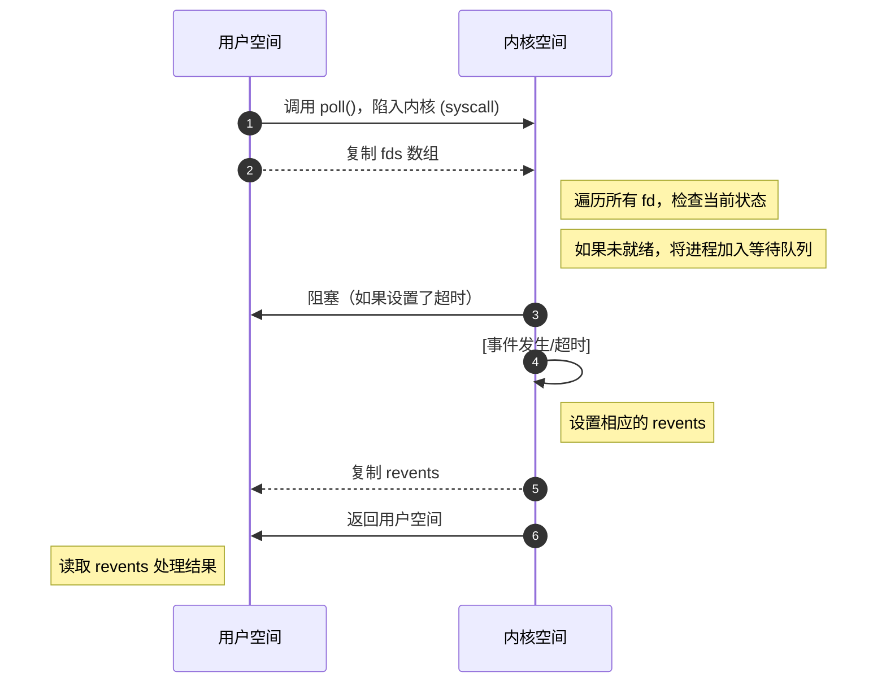

poll 是为了改进 select 系统调用的限制而设计的，特别是突破了 select 对文件描述符数量的限制（select 通常限制为 1024）。

poll 最早出现在 System V Release 3 (1986年) 中，后来被集成到 POSIX 标准中。

<!--more-->

<br/>

## 函数原型

[Linux manual page - poll()](https://man7.org/linux/man-pages/man2/poll.2.html)

```c
#include <poll.h>

int poll(struct pollfd *fds, nfds_t nfds, int timeout);

int ppoll(struct pollfd *fds, nfds_t nfds,
         const struct timespec *_Nullable tmo_p,
         const sigset_t *_Nullable sigmask);
```

* **_Nullable**：用于告诉读者它们可以传递一个 `NULL` 指针，但是头文件中的实际声明是不包含 `_Nullable` 的。

### poll

参数解释如下：

- **fds**: 指向 `pollfd` 结构体数组的指针，`pollfd` 结构体：

    ```c
    struct pollfd {
        int   fd;         /* 监听的文件描述符 */
        short events;     /* 请求监听的事件类型 */
        short revents;    /* 实际发生的事件类型 */
    };
    ```
    
  - `fd`：一个打开的文件描述符。如果 `fd` 为负数，则对应的 `events` 将被忽略，`revents` 返回 0。（这提供了一种在单次 `poll()` 调用中忽略文件描述符的简单方法：只需将 `fd` 字段取负。但请注意，此技术不能用于忽略文件描述符 0。）
  - `events`：是输入参数，是一个位掩码，指定应用程序对文件描述符 `fd` 感兴趣的事件。该字段可以指定为零，此时 `revents` 中唯一可以返回的事件是 `POLLHUP`、`POLLERR` 和 `POLLNVAL`。
  - `revents`：是输出参数，由内核填充实际发生的事件。`revents` 中返回的位可以包括 `events` 中指定的任何位，或者 `POLLERR`、`POLLHUP` 或 `POLLNVAL` 之一。（这三位在 `events` 字段中无意义，只要对应条件为真，就会在 `revents` 字段中设置。）
  
- **nfds**: 调用者应该指定 `fds` 数组中元素的数量。

- **timeout**: 超时时间（毫秒）：

    -  $> 0$：等待指定毫秒数

    - $0$：立即返回，不阻塞

    - $-1$：无限期阻塞，直到有事件发生

- **Return**：

  - $> 0$： `pollfds` 中 `revents` 字段被设置为非零值（指示事件或错误）的元素数量。

  - $= 0$：在任一文件描述符就绪之前系统调用已超时

  - $-1$：出错，并设置 `errno` 以指示错误原因。错误：
    - **EFAULT**：`fds` 指向进程可访问地址空间之外。给定的数组不在调用程序的地址空间中。

    - **EINTR**：在任何请求的事件之前发生了信号；参见 `signal(7)`。
    - **EINVAL**：`nfds` 值超过了 `RLIMIT_NOFILE` 值。
    - **EINVAL**（`ppoll()`）：`*ip` 中表示的超时值无效（负数）。
    - **ENOMEM**：无法为内核数据结构分配内存。


### 事件类型

可以在 `events` 和 `revents` 中设置/返回的位在 `<poll.h>` 中定义：
- **POLLIN**：有数据可读。
- **POLLPRI**：文件描述符上有异常情况。可能包括：
  - TCP 套接字上有带外数据（参见 `tcp(7)`）。
  - 处于包模式的伪终端主设备检测到从设备状态变化（参见 `ioctl_tty(2)`）。
  - `cgroup.events` 文件已被修改（参见 `cgroups(7)`）。
- **POLLOUT**：现在可以写入，尽管写入的数据量大于套接字或管道中的可用空间时仍会阻塞（除非设置了 `O_NONBLOCK`）。
- **POLLRDHUP**（自 Linux 2.6.17 起）：流套接字对端关闭连接，或关闭了写入半连接。必须定义 `_GNU_SOURCE` 功能测试宏（在包含任何头文件之前）才能获得此定义。
- **POLLERR**：错误条件（仅在 `revents` 中返回；在 `events` 中被忽略）。当文件描述符指向管道的写入端，而读取端已关闭时，也会设置此位。
- **POLLHUP**：挂起（仅在 `revents` 中返回；在 `events` 中被忽略）。请注意，当从管道或流套接字等通道读取时，此事件仅表示对端关闭了其通道末端。在通道中所有未处理数据被消耗后，后续读取才会返回 0（文件结束）。
- **POLLNVAL**：无效请求：`fd` 未打开（仅在 `revents` 中返回；在 `events` 中被忽略）。

当定义 `_XOPEN_SOURCE` 时，还有以下位，但它们不提供除上述位之外的更多信息：
- **POLLRDNORM**：等同于 `POLLIN`。
- **POLLRDBAND**：可以读取优先带数据（通常在 Linux 上未使用）。
- **POLLWRNORM**：等同于 `POLLOUT`。
- **POLLWRBAND**：可以写入优先数据。

Linux 也知道 `POLLMSG`，但未使用它。


### ppoll

`poll()` 和 `ppoll()` 之间的关系类似于 `select(2)` 和 `pselect(2)` 之间的关系：与 `pselect(2)` 一样，`ppoll()` 允许应用程序安全地等待，直到文件描述符就绪或捕获到信号。

除了超时参数的精度不同外，以下 `ppoll()` 调用：

```c
ready = ppoll(&fds, nfds, tmo_p, &sigmask);
```

几乎等同于原子性地执行以下调用：

```c
sigset_t origmask;
int timeout;

timeout = (tmo_p == NULL) ? -1 :
         (tmo_p->tv_sec * 1000 + tmo_p->tv_nsec / 1000000);
pthread_sigmask(SIG_SETMASK, &sigmask, &origmask);
ready = poll(&fds, nfds, timeout);
pthread_sigmask(SIG_SETMASK, &origmask, NULL);
```

上述代码段被称为“几乎等效”，因为如果 `poll()` 的超时值为负，则解释为无限超时，而 `*tmo_p` 中表示的负值会导致 `ppoll()` 出错。

关于 `ppoll()` 为何必要的解释，请参见 `pselect(2)` 的描述。

如果 `sigmask` 参数指定为 `NULL`，则不执行信号掩码操作（因此 `ppoll()` 与 `poll()` 的区别仅在于超时参数的精度）。

`tmo_p` 参数指定 `ppoll()` 将阻塞的时间上限。此参数是指向如下形式结构体的指针：

```c
struct timespec {
    long    tv_sec;         /* seconds */
    long    tv_nsec;        /* nanoseconds */
};
```

如果 `tmo_p` 指定为 `NULL`，则 `ppoll()` 可以无限期阻塞。

### 版本
`poll()` 系统调用在 Linux 2.1.23 中引入。在缺少此系统调用的旧内核上，glibc 的 `poll()` 包装函数使用 `select(2)` 提供模拟。

`ppoll()` 系统调用在 Linux 内核 2.6.16 中添加。glibc 2.4 中添加了 `ppoll()` 库调用。

### 遵循标准
`poll()` 符合 POSIX.1-2001 和 POSIX.1-2008。`ppoll()` 是 Linux 特有的。

### 备注
`poll()` 和 `ppoll()` 的操作不受 `O_NONBLOCK` 标志影响。

在某些其他 UNIX 系统上，如果系统无法分配内核内部资源，`poll()` 可能会因 `EAGAIN` 错误而失败，而不是像 Linux 那样返回 `ENOMEM`。POSIX 允许此行为。可移植程序可能希望检查 `EAGAIN` 并循环，就像处理 `EINTR` 一样。

某些实现定义了非标准常量 `INFTIM`，其值为 -1，用作 `poll()` 的超时值。glibc 不提供此常量。

关于如果 `poll()` 正在监视的文件描述符在另一个线程中被关闭可能发生的情况的讨论，请参见 `select(2)`。

### C 库/内核差异
Linux 的 `ppoll()` 系统调用会修改其 `tmo_p` 参数。但是，glibc 包装函数通过使用局部变量作为传递给系统调用的超时参数来隐藏此行为。因此，glibc 的 `ppoll()` 函数不会修改其 `tmo_p` 参数。

原始的 `ppoll()` 系统调用有第五个参数 `size_t sigsetsize`，它指定 `sigmask` 参数以字节为单位的大小。glibc 的 `ppoll()` 包装函数将此参数指定为固定值（等于 `sizeof(kernel_sigset_t)`）。关于内核和 libc 对信号集概念差异的讨论，请参见 `sigprocmask(2)`。

<br/>

## 使用示例

以下是一个简单的示例，展示如何使用 `poll()` 实现一个仅返回固定页面的 http 服务器。

```c
#include <stdio.h>
#include <stdlib.h>
#include <string.h>
#include <unistd.h>
#include <sys/socket.h>
#include <sys/poll.h>
#include <netinet/in.h>
#include <arpa/inet.h>
#include <errno.h>

#define PORT 8080
#define MAX_CLIENTS 1000
#define BUFFER_SIZE 4096
#define BACKLOG_N 1024

int create_tcp_server(){
    int server_fd;
    struct sockaddr_in address;
    int opt = 1;
    
    // 创建socket
    if ((server_fd = socket(AF_INET, SOCK_STREAM, 0)) == 0) {
        perror("socket failed");
        exit(EXIT_FAILURE);
    }
    
    // 设置socket选项，允许端口重用
    if (setsockopt(server_fd, SOL_SOCKET, SO_REUSEADDR, &opt, sizeof(opt))) {
        perror("setsockopt failed");
        exit(EXIT_FAILURE);
    }
    
    address.sin_family = AF_INET;
    address.sin_addr.s_addr = INADDR_ANY;
    address.sin_port = htons(PORT);
    
    // 绑定socket
    if (bind(server_fd, (struct sockaddr *)&address, sizeof(address)) < 0) {
        perror("bind failed");
        exit(EXIT_FAILURE);
    }
    
    // 开始监听
    if (listen(server_fd, BACKLOG_N) < 0) {
        perror("listen failed");
        exit(EXIT_FAILURE);
    }
    
    printf("HTTP服务器已启动，监听端口 %d...\n", PORT);
    return server_fd;
}

void send_http_response(int client_fd) {
    char *response = 
        "HTTP/1.1 200 OK\r\n"
        "Content-Type: text/html; charset=UTF-8\r\n"
        "Connection: close\r\n"
        "\r\n"
        "<!DOCTYPE html>\n"
        "<html>\n"
        "<head>\n"
        "    <title>Simple HTTP server(poll)</title>\n"
        "</head>\n"
        "<body>\n"
        "    <h1>Hello from Poll HTTP Server!!!!</h1>\n"
        "    <p>This is a simple HTTP server written in C language</p>\n"
        "    <p>Limit on client connections: %d</p>\n"
        "</body>\n"
        "</html>";
    
    char full_response[512];
    int len = snprintf(full_response, sizeof(full_response), response, MAX_CLIENTS);
    
    write(client_fd, full_response, len);
}

int main() {
    int server_fd = create_tcp_server();
    int new_socket, i;
    struct sockaddr_in address;
    int addrlen = sizeof(address);
    char buffer[BUFFER_SIZE];
    
    // 初始化pollfd数组
    //struct pollfd fds[MAX_CLIENTS + 1];  // +1 给服务器socket
    struct pollfd  *fds = calloc(MAX_CLIENTS + 1, sizeof(struct pollfd));
    if (!fds) {
        perror("calloc failed");
        exit(EXIT_FAILURE);
    }
    for (i = 0; i <= MAX_CLIENTS; i++) {
        fds[i].fd = -1;  // 初始化为无效fd
        fds[i].events = 0;
        fds[i].revents = 0;
    }
    
    // 设置服务器socket
    fds[0].fd = server_fd;
    fds[0].events = POLLIN;  // 监听读事件
    
    while (1) {
        // 调用poll等待事件
        int ready = poll(fds, MAX_CLIENTS + 1, -1);  // -1表示无限等待
        
        if (ready < 0) {
            if (errno == EINTR) {
                continue;  // 被信号中断，继续
            }
            perror("poll failed");
            exit(EXIT_FAILURE);
        }
        
        // 检查是否有新连接
        if (fds[0].revents & POLLIN) {
            if ((new_socket = accept(server_fd, (struct sockaddr *)&address, 
                                     (socklen_t*)&addrlen)) < 0) {
                perror("accept");
                continue;
            }
            
            printf("新连接，socket fd: %d, IP: %s, 端口: %d\n", 
                   new_socket, inet_ntoa(address.sin_addr), ntohs(address.sin_port));
            
            // 找到空闲位置存储新连接
            for (i = 1; i <= MAX_CLIENTS; i++) {
                if (fds[i].fd == -1) {
                    fds[i].fd = new_socket;
                    fds[i].events = POLLIN;  // 监听读事件
                    printf("添加到位置 %d\n", i - 1);
                    break;
                }
            }
            
            // 如果没有空闲位置，关闭连接
            if (i > MAX_CLIENTS) {
                printf("连接数已达上限，拒绝新连接\n");
                close(new_socket);
            }
            
            // 减少计数，因为处理了一个事件
            ready--;
        }
        
        // 处理客户端请求
        for (i = 1; i <= MAX_CLIENTS && ready > 0; i++) {
            if (fds[i].fd != -1 && (fds[i].revents & (POLLIN | POLLERR | POLLHUP))) {
                ready--;
                
                // 检查连接是否关闭或出错
                if (fds[i].revents & (POLLERR | POLLHUP)) {
                    printf("客户端异常断开，socket fd: %d\n", fds[i].fd);
                    close(fds[i].fd);
                    fds[i].fd = -1;
                    fds[i].events = 0;
                    continue;
                }
                
                // 读取数据
                int valread = read(fds[i].fd, buffer, BUFFER_SIZE - 1);
                
                if (valread == 0) {
                    // 客户端正常关闭连接
                    getpeername(fds[i].fd, (struct sockaddr*)&address, (socklen_t*)&addrlen);
                    printf("客户端断开连接，IP: %s, 端口: %d\n", 
                           inet_ntoa(address.sin_addr), ntohs(address.sin_port));
                    
                    close(fds[i].fd);
                    fds[i].fd = -1;
                    fds[i].events = 0;
                } else if (valread < 0) {
                    // 读取错误
                    if (errno != EWOULDBLOCK && errno != EAGAIN) {
                        perror("read error");
                        close(fds[i].fd);
                        fds[i].fd = -1;
                        fds[i].events = 0;
                    }
                } else {
                    // 成功读取数据
                    buffer[valread] = '\0';
                    printf("收到请求 (socket %d):\n%s\n", fds[i].fd, buffer);
                    
                    // 简单的HTTP响应
                    send_http_response(fds[i].fd);
                    
                    // 发送响应后关闭连接
                    close(fds[i].fd);
                    fds[i].fd = -1;
                    fds[i].events = 0;
                }
            }
        }
    }
    
    close(server_fd);
    free(fds);
    return 0;
}
```

在这个示例中，利用 `poll` 系统调用实现了对多个客户端连接的**I/O多路复用**。它能够交替处理新的连接请求和已连接客户端的数据收发，而不必为每个客户端创建单独的线程或进程。

其主要工作流程如下：


<br/>

## 实现原理

**数据结构**：

* 内核维护一个就绪队列（ready list）
* 每个 pollfd 对应一个等待队列节点
* 当文件描述符对应的事件发生时，内核将该节点标记为就绪（poll 是**水平触发**（Level-Triggered）：只要文件描述符处于就绪状态，每次调用 poll 都会报告）

**工作流程**：



<br/>

## 与 select 的比较

| 特性               | poll                                                      | select                                                       |
| ------------------ | --------------------------------------------------------- | ------------------------------------------------------------ |
| 文件描述符数量限制 | 无硬编码限制                                              | 通常 1024 (FD_SETSIZE)                                       |
| 内存使用           | 用户空间到内核：pollfd\*len；内核到用户空间：revents\*len | 用户空间到内核：fd_set（1024bits）；内核到用户空间：fd_set（1024bits） |
| 效率               | O(n) 遍历                                                 | O(n) 遍历                                                    |
| 可移植性           | 较好                                                      | 非常好                                                       |
| 重新初始化         | -                                                         | 需要重置 fd_set                                              |
| 超时精度           | 毫秒                                                      | 微秒                                                         |

<br/>

## 现代替代方案

- **epoll** (Linux)：更适合大量连接，O(1) 复杂度
- **kqueue** (BSD)：BSD 系统的高性能方案
- **IOCP** (Windows)：Windows 的完成端口模型

poll 在现代高并发系统中逐渐被 epoll/kqueue 替代，但在文件描述符数量不多、需要跨平台兼容的简单场景中仍然有用。

<br/>

## 参考

* 《Linux/UNIX 系统编程手册》第63章
* [Linux manual page - poll()](https://man7.org/linux/man-pages/man2/poll.2.html)
* [poll - man.cx manual pages](https://man.cx/poll)
