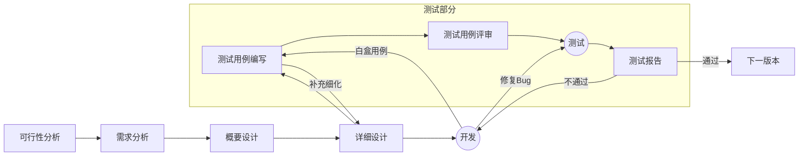

**测试用例（Test Case）**是指对一项特定的软件产品进行测试任务的描述，体现测试方案、方法、技术和策略。简单地认为，测试用例是为某个特殊目标而编制的一组测试输入、执行条件以及预期结果，用于核实是否满足某个特定软件需求。

本篇以一个模板为中心，结合开发流程、测试方法、用例管理，指导如何编写一份完备的测试用例。

<!--more-->

 

# 测试流程概览

以下是软件开发过程中，软件测试的主要流程：

可行性分析、需求分析、概要设计、详细设计 阶段都要产出文档，都要经历评审。上图主要突出测试部分，所以未表示出来。

前面阶段产出的所有文档都会作为下一阶段的输入。

 

# 测试用例编写

## 文件命名

**用例命名规范**：`[软件名]-test-cases-[版本号].xlsx`，例如：`KD-test-cases-0.1.xlsx`。版本号 `0.1` 为评审通过的正式版本，未评审的版本可以用 `0.1a1/2/...` 表示。

**测试报告命名规范**：`[软件名]-test-report-[版本号]-[测试日期]-[测试时分].xlsx`，例如：`KD-test-report-0.1-20250425-1200.xlsx`

保存所有测试用例历史版本，以便回溯和对比。

 

## 模板填写

[模板](\resources\test-case\test-case-template-0.1.xlsm)一览：

### 1. 填写测试用例信息

包括但不限于：

* **用例版本**：和文件名版本号保持一致。
* **编辑人员**
* **最后修改时间**
* **修改说明**

### 2. 测试报告信息

测试报告信息是测试人员在使用本测试用例生成测试报告时填写的，在用例编写阶段只需要确定必须填写的项目即可。

包括但不限于：

* **软件版本**
* **测试人员**
* **测试时间**
* **测试环境**
* **测试工具**

### 3. 填写具体的用例条目

每一条测试用例都包含了以下信息：

* **用例 ID**：以 "软件名称-唯一数字ID" 的格式填写。数字 ID 一旦确定就不能更改，新增项只能递增，方便追踪Bug。
* **测试项目**：较大的模块划分。使用 Excel 的数据筛选功能，可以很方便的查看同一个模块的所有测试条目。
* **测试摘要**：简要的具体测试项目描述。
* **测试方法**：按照 [测试操作方法](#测试操作方法) 中的所有测试方法补充完善用例。
* **前提条件**：测试条目的前置状态描述。
* **操作步骤**：实施测试用例时的执行步骤。
* **预期结果**：软件设计中预期的正确结果。
* **实际结果**：实际的测试结果，由测试人员填写。
* **测试结论**：测试结果判定，由测试人员确定。模板中提供下拉选择操作，可选项包括：通过、不通过、初步实现、暂不支持，选择对应的选型会自动显示不同的颜色，方便查看。使用 Excel 的数据筛选功能，也可以快速地将所有未通过的条目筛出。
* **缺陷级别**：错误结果对软件产生的影响大小，按严重到轻微的顺序提供了可选项：高、中、低。在用例编写阶段即可确定，测试阶段也可被测试人员调整。
* **测试时间**：由测试人员填写，填写此用例最后的测试时间。
* **备注**：用于填写备注信息。

 

## 测试方法

### 宏观划分

#### 黑盒测试

又称为数据驱动测试或基于规格说明的测试。黑盒测试就是把程序看作一个不能打开的黑盒子，在不考虑程序内部逻辑结构和内部特性的情况下测试程序的功能。测试者要在软件的接口处进行测试，它只检查程序功能是否按照规格说明书的规定正常使用、程序是否能接收输入数据而产生正确的输出信息，以及性能是否满足用户的需求，并且保持数据库或外部信息的完整性。通过黑盒测试可以检测每个功能是否都能正常运行，因此黑盒测试又可称为从用户观点和需求出发进行的测试。

由于黑盒测试不考虑程序内部结构，只关心软件的功能，所以许多高层的测试（如确认测试、系统测试、验收测试）都采用黑盒测试。设计黑盒测试用例可以与软件实现同时进行，因此可以缩短整个测试的时间。

设计黑盒测试用例的方法如下：等价类划分法、边界值分析法、因果图法、判定表驱动法、场景法、功能图法、错误推测法、正交试验设计法。

黑盒测试必须遵循以下原则：

1. 根据软件规格说明书设计测试用例，规格说明书的正确性是至关重要的。
2. 有针对性地查找问题，并且正确定位等价类。
3. 检查功能是否有缺陷或错误。
4. 根据测试的重要性来确定测试等级和测试重点，减少程序可能出现的缺陷。
5. 检查在接口处输入的信息是否能正确接收，以及接收后能否输出正确的结果。
6. 认真选择测试策略，尽可能发现程序的数据结构错误或外部信息访问错误，站在用户角度进行测试。

#### 白盒测试

又称结构测试、透明盒测试、逻辑驱动测试或基于代码的测试。白盒法全面了解程序内部逻辑结构、对所有逻辑路径进行测试。

白盒测试是指基于一个应用代码的内部逻辑知识，即基于覆盖全部代码、分支、路径、条件，使用程序设计的控制结构导出测试用例，是软件测试的主要方法之一。这种测试对测试工程师的编码能力要求很高，需要了解程序的构架、具体需求，以及一些编写程序的技巧，能够检查一些程序规范、指针、变量、数组越界等问题，使得问题在前期就暴露出来。白盒测试又叫结构测试或逻辑驱动测试，它知道产品内部工作过程，可通过测试来检测产品内部动作是否按照规格说明书的规定正常进行；按照程序内部的结构测试程序，检验程序中的每条通路是否都能按预定要求正确工作，而不顾它的功能。白盒测试主要用于软件验证。一般程序容易犯的错误包括没有定义变量、无效引用、野指针、超过数组下标、内存分配后没有删除、无法调入循环体、函数本身没有析构、循环失效或者死循环、参数类型不匹配、调用系统的函数没有考虑到系统的兼容性等。

白盒测试一般是以单元或者模块为基础的。目前的做法是把它归结为开发的范畴，用专人或者兼职的人员或者利用部分工具（如Rational系列、Boundchecker等工具）检查代码，有助于发现变量没有初始化、指针错误等。

白盒测试的优点是帮助软件测试人员增大代码的覆盖率，提高代码的质量，发现代码中隐藏的问题。白盒测试主要是检查程序的内部结构、逻辑、循环和路径。常用的测试用例设计方法有代码检查法、静态结构分析法、静态质量度量法、逻辑覆盖法、基本路径测试法、域测试法、符号测试法、Z路径覆盖法、程序变异测试法等，运用最为广泛的是基本路径测试法。

白盒测试方法分为静态测试和动态测试。白盒测试的策略是首先进行静态结构分析，采用先静态后动态的组合方式，然后进行覆盖测试。

1）静态测试：静态测试是测试中很重要的方法之一。它不要求在计算机上实际执行所测程序，主要以一些人工的模拟技术对软件进行分析和测试。静态测试大约可以找出25%～60%的逻辑错误。

2）动态测试：输入一组预先按照一定的测试准则设计的实例数据驱动运行程序，检查程序功能是否符合设计要求，发现程序中错误的过程。

白盒测试必须遵循以下原则：

1. 保证一个模块中所有路径至少被测试一次。
2. 所有逻辑值都要测试真（true）和假（false）两种情况。
3. 检查程序的内部数据结构是否有效。
4. 在上、下边界及可操作范围内运行所有循环。

### 不同阶段的测试

* **单元测试**：是对一个完整的类、接口、子程序单独进行测试。单元测试的主要任务有程序语法检查、程序逻辑检查、模块接口测试、局部数据结构测试、路径测试、边界条件测试、错误处理测试、代码书写规范检查。
* **功能测试**：用于测试软件的各个功能模块是否正确。这种测试的目标是检查数据的接收、处理和检索是否正确，以及业务规则的实施是否恰当。此类测试基于黑盒技术，是对单元测试的补充，通过图形用户界面与应用程序进行交互，并对交互的结果进行分析，以此来核实应用程序及其内部进程。它虽然是单元测试的补充，但两者又有不同之处，主要表现为：单元测试说明了代码执行是否正确，功能测试说明了完成的功能是否执行正确的操作；单元测试往往是从代码开发人员的角度来看，而功能测试是从最终用户和业务过程角度来看。
* **集成测试**：是对两个或更多的类、包或者子系统进行联合测试。也称为组装测试或子系统测试。集成测试是在所有模块都通过单元测试和子系统的功能测试的基础上，按照系统设计说明书的要求组合起来进行的测试。集成测试主要由系统设计人员、软件评测人员、开发人员共同完成的。
* **回归测试**：是指Bug被开发人员修改后，重复执行以前的测试用例。在软件生命周期中的任何一个阶段，只要软件发生了改变，我们就必须重新测试现有的功能，以便确定修改是否达到了预期的目的。修改有可能导致软件未被修改的部分产生新的问题，使本来工作正常的功能产生错误；同样，在有新代码加入软件的时候，除了新加入的代码中有可能含有错误外，新代码还有可能对原有的代码产生影响，此时增添新的测试用例和原有的测试用例对软件进行再测试，称为回归测试。
* **系统测试**：是在用户环境的配置下运行整个软件。以测试安全、性能、资源消耗、时序方面的问题，以及其他无法在低级集成上测试的问题。是在完成集成测试的工作后，将通过集成测试的软件和硬件等设备连接在一起，按照需求说明书，对系统进行的一系列测试。**系统测试包括**：功能性测试、性能测试、负载测试、强度测试、容量测试、安全性测试、配置测试、故障恢复测试、安装测试、文档测试、用户界面测试等，其中，功能测试、性能测试、配置测试、安装测试在一般情况下是必需的，而其他的测试类型则需要根据软件项目的具体要求进行裁剪。重点是从操作者的角度，测试系统对用户支持的情况，用户界面的规范性、友好性、可操作性，以及数据的安全性。
* **验收测试**：目的是为了检证此系统是否能够满足用户的需要，产品通过验收测试后工作才算最终结束。验收可分为前阶段验收和竣工验收两个阶段。验收是根据各种需求说明书的标准，利用工具进行的一项检查工作，其中包括对进程的验收，以及进程质量是否达到需求书的要求、是否符合工程的设计要求等。验收测试是依据软件开发商和用户之间的合同、软件需求说明书以及相关行业标准、国家标准、法律法规等的要求对软件的功能、性能、可靠性、易用性、可维护性、可移植性等特性进行的严格测试，验证软件的功能和性能及其他特性是否与用户需求一致。

### 测试操作方法

从操纵层面划分的测试方法：

* **静态测试**：它不要求在计算机上实际执行所测程序，主要以一些人工的模拟技术对软件进行分析和测试。静态测试大约可以找出25%～60%的逻辑错误。
* **动态测试**：输入一组预先按照一定的测试准则设计的实例数据驱动运行程序，检查程序功能是否符合设计要求，发现程序中错误的过程。
* **等价类测试**：等价类划分法是一种典型的、重要的黑盒测试方法，它将程序所有可能的输入数据（有效的和无效的）划分成若干个等价类。然后从每个部分中选取具有代表性的数据当作测试用例进行合理的分类，测试用例由有效等价类和无效等价类的代表组成，从而保证测试用例具有完整性和代表性。利用这一方法设计测试用例可以不考虑程序的内部结构，以需求规格说明书为依据，选择适当的典型子集。
* **边界值测试**：是用于对输入或输出的边界值进行测试的一种典型、重要的黑盒测试方法。在测试过程中，边界值分析法是作为对等价类划分法的补充，专注于每个等价类的边界值，两者的区别在于前者在等价类中随机选取一个测试点。详情参见《软件测试实用技术与常用模板（第2版）》3.3.2。
* **因果图测试**：因果图法也是较常用的一种黑盒测试方法，它是一种简化了的逻辑图。因果图能直观地表明输入条件和输出动作之间的因果关系，能帮助测试人员把注意力集中到与程序功能有关的那些输入组合，比采用等价分类法有更高的测试效率，但这种方法的操作步骤比较复杂。因果图法是一种适合于描述多种输入条件组合的测试方法，根据输入条件的组合、约束关系和输出条件的因果关系，分析输入条件的各种组合情况，从而设计测试用例，它适合于检查程序输入条件涉及的各种组合情况。因果图法一般和判定表结合使用，通过映射同时发生相互影响的多个输入来确定判定条件。因果图法最终生成的就是判定表，它适合于检查程序输入条件的各种组合情况。详情参见《软件测试实用技术与常用模板（第2版）》3.3.3。
* **判定表测试**：它是分析和表达多逻辑条件下执行不同操作情况的工具。在程序设计发展初期，判定表就已被当作编写程序的辅助工具了。判定表测试严格，能够将复杂的逻辑关系和多种条件组合的情况表达得既具体又明确，针对不同的逻辑条件组合值分别执行不同的操作。因此，使用判定表能够设计出完整的测试用例集合。判定表是一种针对存在条件、动作关系或者因果关系的特性进行测试的用例设计方法。详情参见《软件测试实用技术与常用模板（第2版）》3.3.4。
* **场景测试**：场景用来描述流经用例的路径，从用例开始到结束遍历这条路径上所有的基本流和备选流。详情参见《软件测试实用技术与常用模板（第2版）》3.3.5。
* **功能图法测试**：功能图法是用功能图形象地表示程序的功能说明，由状态迁移图和布尔函数组成，同时需要依靠判定表或因果图表示逻辑功能，并机械地生成功能图的测试用例，功能图法是黑盒、白盒混合用例的设计方法。详情参见《软件测试实用技术与常用模板（第2版）》3.3.6。
* **错误推测法测试**：错误推测法是基于以往的经验和直觉，参照以往的软件系统出现的错误，推测程序中所有可能存在的各种缺陷和错误，从而有针对性地设计测试用例。错误推测法的基本思路是：列举出程序中所有可能的错误和容易发生错误的特殊情况，根据可能出现的错误情况选择测试用例。详情参见《软件测试实用技术与常用模板（第2版）》3.3.7。
* **正交试验法测试**：正交试验设计法是依据Galois理论，从大量的（实验）数据（测试用例）中挑选适量的、有代表性的点（例），从而合理地安排试验（测试）的一种科学试验设计方法。详情参见《软件测试实用技术与常用模板（第2版）》3.3.8。
* **自动化测试**：自动化测试是把以人为驱动的测试行为转化为机器执行的一种过程。软件自动化测试采用的技术主要有：录制/回放、脚本技术、数据驱动、关键字驱动、业务驱动。
* **性能测试**：是通过自动化的测试工具模拟多种正常、峰值以及异常负载条件来对系统的各项性能指标进行测试。针对整个系统的测试，**包含 并发性能测试、负载测试、压力测试、强度测试、破坏性测试。**性能测试（Performance Testing）分为基本性能测试和高级性能测试。基本性能测试的主要内容包括安全可靠性、资源占用率、兼容性、易用性、用户文档、效率、可扩充性等测试。高级性能测试的主要内容包括并发性能、系统资源监控、大数据量、速度、疲劳等测试，其重点是并发性能测试。性能测试以自动化测试为主，人工测试为辅。性能测试主要是通过自动化测试工具模拟多种正常、峰值以及异常负载条件来对系统的各项性能指标进行测试。性能测试总体来说是来自于客户而又服务于客户的，也就是说性能测试主要是根据客户需求，以达到客户的要求为目的，同时测试的结果又提供给客户使用。尤其对于实时系统、嵌入式系统和在线服务系统，性能要求会更高些。一般性能测试都是通过测试工具来模拟人为的操作而进行的。性能测试的重点在于测试环境的建立、前期数据的设计与后期数据的分析。

* **安全性测试**：安全性测试主要包括两个部分：测试数据的安全性和操作的安全性。也就是说，只有规定的数据才可以访问系统，其他不符合规定的数据不能访问系统；只有规定的操作权限才可以访问系统，其他不符合要求的操作权限不能访问系统。
* **用户界面测试**：在确保用户界面能够通过测试对象控件或入口得到相应访问的情况下，测试用户界面的风格是否满足用户要求，如界面是否美观、界面是否直观、操作是否友好、易操作性是否够好。
* **可维护性测试**：是指系统软、硬件实施和维护功能的方便性，目的是降低维护功能对系统正常运行带来的影响。
* **兼容性测试**：系统中软件与各种硬件设备兼容性，与操作系统的兼容性及与支撑软件的兼容性。
* **网络测试**：在网络环境下，系统软件对接入设备的支持情况。
* **安装升级测试**：安装测试的目的是确保该软件在正常和异常的情况下进行安装时都能按预期目标来处理。例如，正常情况下，第一次安装或升级、完整的或自定义的安装都能进行。异常情况包括磁盘空间不足、缺少目录创建权限等。还有一个目的是核实软件在安装后是否可立即正常运行。另外对安装手册、安装脚本等也需要关注。
* **拷机测试**：（Burn-in Test）是一种通过长时间、高负荷运行设备或软件，验证其稳定性、兼容性和可靠性的测试方法。该测试广泛应用于电子产品（如计算机、芯片）、软件系统及工业设备等领域，旨在发现早期设计缺陷或硬件故障，降低产品出厂后的故障率。
* **压力测试**：（Stress Testing），模拟实际环境和用户使用过程中的系统负荷，使系统使用长时间或超大负荷的运行测试软件，从而测试系统的性能、稳定性、可靠性等。压力测试是在软件系统使用前，通过执行重复的负载测试，了解系统的性能瓶颈和可靠性等，以提高软件系统的可靠性和稳定性，在规定的规格条件或者超过规定的规格条件下，测试一个系统，以评价其行为。它类似于负载测试，通常是性能测试的一部分。
* **容错测试**：若新系统在运行时出现错误，要能够在最短的时间内查出问题之所在，并以最快的速度修改错误，使新系统能重新正常运行。
* **负载测试**：（Load Testing）通过测试系统在资源超负荷情况下的表现，发现设计上的错误或验证系统的负载能力。此测试的目标是确定系统在超出预期工作量的情况下能否正常运行。此外，负载测试还要评估系统的性能特征，如系统的响应时间、事务处理等。
* **容量测试**：（Capacity Testing），通过测试预先分析出反映系统应用特征的某项指标的极限值或在苛刻的环境中表现出系统的性能，在一定程度上完成负载测试和容量测试，如果系统的实际容量不满足要求，就应寻求新的解决方案，提高系统的容量；如果实际容量已满足要求，就能使用户对产品建立信心。
* **配置测试**：指的是软件生产过程中所需要的硬件、软件，以及开发过程中产生的各种各样的文档资料。配置测试就是从用户使用的角度出发，对它们进行全方位的测试，保证软件在网络操作系统下能够正常运行。
* **强度测试**：是一种**性能测试**，通过模拟系统在高负载、资源受限或极端条件下的运行状态，验证其稳定性、可靠性及性能瓶颈。核心目标是识别系统在资源争用（如内存不足、CPU高占用）或极限压力下的表现。
* **破坏性测试**：是一种**主动引发系统失效**的测试方法，通过模拟极端操作或异常输入（如断网、硬件故障、恶意攻击），评估系统的容错能力和恢复机制。其本质是验证系统在崩溃或异常后的行为是否符合预期。

 

# 测试用例评审

参与评审的人员包括测试经理、测试人员、研发经理、产品经理、研发人员、质量检验人员等。

测试用例评审内容如下：

* 测试用例中用户需求和测试功能点是否与测试计划和测试方案对应？
* 测试用例标识是否按照测试方案的规则来编写？
* 测试环境描述是否清晰？
* 设计测试用例是否运用了三种或三种以上的设计方法？
* 是否每个测试用例的预置条件都描述清楚了？
* 每个测试用例的“输入”是否列出了所有测试的输入数据？
* 步骤、输入和输出内容是否清晰？
* 测试用例的“预期结果”是否完整而且清晰？
* 是否明确说明了每个测试用例或测试用例集的重要级别？
* 是否明确说明了测试用例的执行顺序？
* 在测试用例分析中测试深度是否描述了使用的测试技术和方法？

## 用例管理

评审之后，随着软件需求的变更、功能的改进等对测试用例进行添加、修改、删除。评审之后的测试用例和后期修改的测试用例要随时进行归档，进行测试文档的管理。为了方便测试用例的维护和管理，以及多个版本的测试用例共存，测试用例需要专人定期维护并遵循以下原则。

（1）及时删除过时的测试用例

需求变更可能导致原有部分测试用例不再适合新的需求。例如删除了某个功能，那么针对该功能的测试用例也不再需要。

（2）及时删除冗余的测试用例

在设计测试用例时，可能存在两个或者多个测试用例相同，降低了回归测试效率，所以要定期整理测试用例集，及时删除冗余的测试用例。

（3）增加新的测试用例

由于需求变更、用例遗漏或者版本发布后发现缺陷等原因，原有的测试用例集没有完全覆盖软件需求，需要增加新的测试用例。

（4）改进测试用例

随着开发工作的进行，测试用例不断增加，可能会出现一些对输入或者运行状态比较敏感的测试用例。这些用例难以重用，影响回归测试的效率，需要进行改进，使之可重用、可控制。

 

# 参考

* [测试用例_百度百科](https://baike.baidu.com/item/测试用例/1928697)
* 《软件测试实用技术与常用模板（第2版）》李龙 黎连业 编著
* 《Google软件测试之道》
* 《软件测试技术实战：设计、工具及管理》
